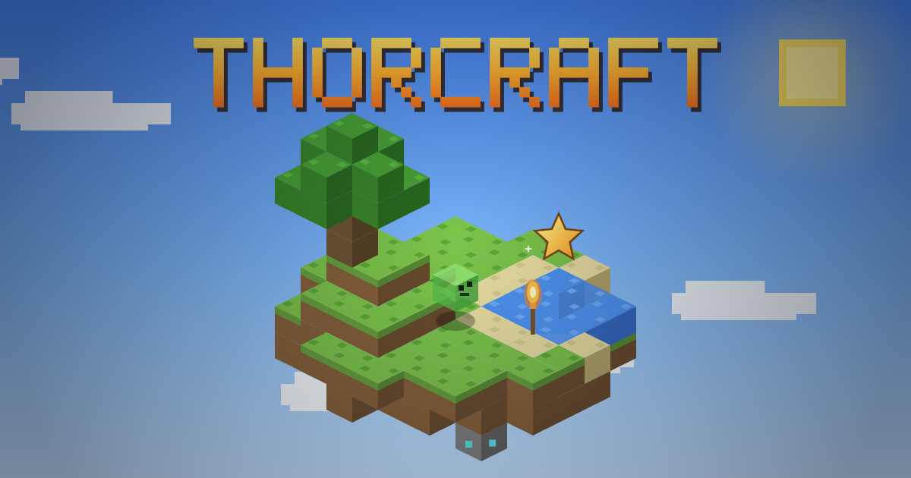

# ThorCraft

[](https://thorcraft.vercel.app)

**Play: [thorcraft.vercel.app](https://thorcraft.vercel.app)**

A voxel sandbox where world is drawn by [`@thorvg/webcanvas`](../thorvg.web/packages/webcanvas), a light-weight engine.

```bash
npm install
npm run dev        # http://localhost:5188
```

## Controls

| Input | Action |
| --- | --- |
| WASD / arrows, Space, Shift, Ctrl or double W | move, jump / swim up, sneak (no falling off edges), sprint |
| Mouse, LMB, RMB, MMB | look, mine / attack, place / use / eat / ignite TNT, pick block (creative) |
| 1-9, wheel, Q | hotbar, drop one item |
| E | inventory with 2x2 crafting (survival) or the full item palette (creative) |
| RMB on a crafting table / furnace | 3x3 crafting, smelting |
| F5 or V | first person, third person back, third person front |
| Double Space or F | toggle flying (creative), Shift / C to descend |
| M, F3, Esc / P | minimap, debug overlay, pause (view distance, FOV, sensitivity, volume, game mode) |

In the item windows: LMB picks up / puts down / swaps, RMB splits a stack or places one item, Shift + click moves a stack.

URL parameters: `renderer=gl|wg|sw`, `seed=abc`, `dist=64` (fixed view distance),
`autoplay=creative|survival`, `fresh` (ignore the save), `debug`.

## What is in the game

- Infinite chunked terrain: oceans, beaches, plains, forests, deserts, snowy taiga, mountain ridges, caves with lava,
  ore veins, oak / birch / spruce trees, tall grass, flowers, cacti
- Vector pixel art: every 16x16 procedural texture is quantized and merged into rectangles, with 16 / 8 / 4 / 2 texel
  levels of detail picked by distance, plus ambient occlusion strips, sky exposure shadows and torch light
- Survival: mining times by tool type and tier, tool durability, drops, shaped crafting (40+ recipes), furnace smelting
  with fuel, food, health regeneration, fall / drowning / lava damage
- Mobs with box models and walk cycles: pigs, cows, sheep, zombies that burn at dawn, creepers that blow up
- Block physics: falling sand and gravel, spreading water, plants and torches popping off, TNT chain reactions
- Day/night cycle with gradient sky, sun, moon, stars, clouds, sunset tint and distance fog
- First person hand with the held block or item, third person avatar, particles, item drops, collectible gems,
  minimap, synthesized per-material sound
- ThorVG showcase: scene post effects (pause blur, underwater / lava / night / hurt tint), light halos with voxel
  occlusion tests, Lottie driven HUD (hearts that crack and beat, furnace flame and trim path progress arrow) and Lottie
  billboards in the world (mob alerts, creeper fuse rings, gem sparkles), SVG sun, moon phases and tinted SVG clouds,
  clip masked round minimap, trim path mining ring, gradient text logo. `?nofx` turns the effects off
- Lottie in 3D (`src/lottie3d.ts`): any 2D Lottie becomes world geometry. The loaded animation's scene tree is walked
  with an Accessor per frame, every shape is flattened to polygons (its full transform is recovered from the oriented
  bounding box) and projected by the block renderer, so 2D characters get perspective, occlusion by terrain, lighting
  and fog. By default the art is not a flat card: each shape is extruded into a slab with shaded side walls and the
  slabs are stacked in artwork order on a plane that follows the mob's heading, so it has thickness, layer parallax and
  a back side (`cmd('/lottie3d card')` switches to camera facing cards). Slimes and ghosts are Lottie mobs, the Lottie Star is a Lottie item (world drop, hand, inventory icon),. Masks / mattes and gradients are not
  reproduced (gradients use their average color)
- Villages (Craftstead): planned per region from the seed and stamped into chunks (houses, smithy, library, farms,
  well, lamp posts, paths; wood or sandstone by biome), one always near the spawn. Villagers are Lottie characters
  with three professions; right click to trade, the gems found around the world are the currency. Hostile mobs do
  not spawn inside a village, but once a night a raid may hit it, and repelling it pays
- Ember Depths (nether-like): build an obsidian frame (2 x 3 inside or larger) and light it with an Igniter. A closed
  cave world of ember rock over lava seas with ash, magma, glow crystals and ember ore (smelts into the fifth tool
  tier); Cinders (Lottie fireballs that shoot) and Ashlings roam it. Portals are linked in pairs and work both ways
- Vector Void (end-like): Vector Eyes (ember ingots + diamond, or the librarian) point to the stronghold, whose stair
  tunnel surfaces at a lantern ruin; twelve eyes open the portal. Islands of outlined void stone under an SVG planet
  and aurora, Glitches that turn hostile when stared at, and The Outline, a boss shielded by anchor crystals on
  obsidian pillars. Defeating it opens the way home and drops a trophy
- The ending (`src/ending.ts`): stepping into the way home melts the Void away (scene blur and tint) and plays the
  end poem, a conversation between the Stroke and the Fill about the player, typed out over polygons that draw
  themselves with trim paths. Then the credits roll: the gradient logo, the cast as live Lottie animations, every
  engine feature that drew the world, and the stats of your run (days, blocks mined and placed, mobs slain, deaths,
  distance, dimensions, advancements). Hold Space to hurry, Esc to skip; the credits end with the way back to spawn
- Advancement toasts; dev cheats: `/dim`, `/locate village|stronghold`, `/gems`, `/summon cinder|ashling|glitch|outline`, `/ending`
- World edits, inventory, furnaces and player state persist in `localStorage`
